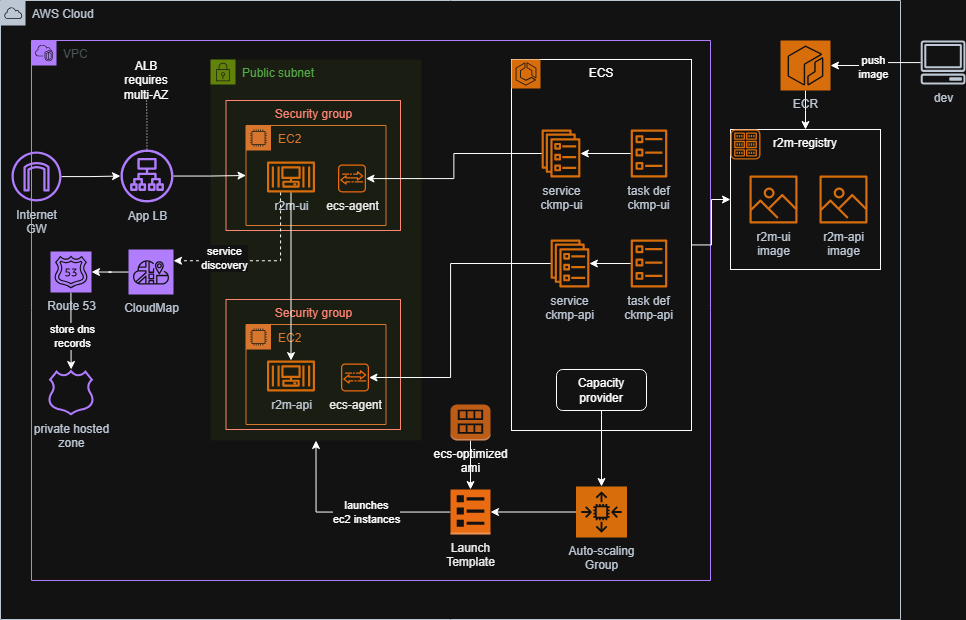

# Container Deployment (ECS)



requirements:
1. aws cli installed
2. aws IAM identity center configured
3. docker installed

To deploy the ECS cluster on EC2 please follow the next commands:  

```sh
aws sso login
make all
```

### Build images
```sh
make build_images
```

### Upload images to ECR
```sh
make push_images
```

### Deploy containers
```sh
make deploy_ecs_cluster
```

### Run tests


#### Manual test
1. Verify Web is deployed by going to elb in EC2 console
2. In detail page copy elb dns and change protocol to HTTP in url