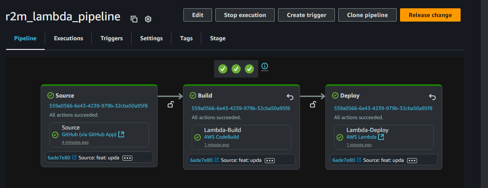

# Codepipeline Lambda Delivery

`Note:` The build spec is for now configured to run with a helloworld lambda setup



### Study Notes:

1. Code pipeline requires a code connection to connect to Github App
2. Code pipeline store the output of each action in the S3 bucket provided to code pipeline
3. Code pipeline and Code Build have different role and policies attached

### Pre - Requisites

1. Code connection: Create a connection
2. Lambda function: Create a lambda function

### Execution
Set variables in the .tfvars

```sh
tofu init
tofu.exe apply -var-file="dev.tfvars" --auto-approve
tofu.exe destroy -var-file="dev.tfvars" --auto-approve
```

## Reference

#### Code Pipeline

- Action structure reference: [Link](https://docs.aws.amazon.com/codepipeline/latest/userguide/action-reference.html)

#### Code Build
- CodeBuild available images: [Link](https://docs.aws.amazon.com/codebuild/latest/userguide/available-runtimes.html)
- EC2 Compute images reference: [Link](https://docs.aws.amazon.com/codebuild/latest/userguide/ec2-compute-images.html)
- Build spec runtime version: [Link](https://docs.aws.amazon.com/codebuild/latest/userguide/runtime-versions.html)